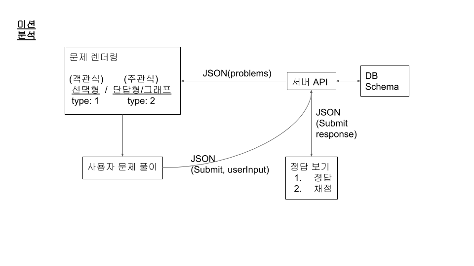
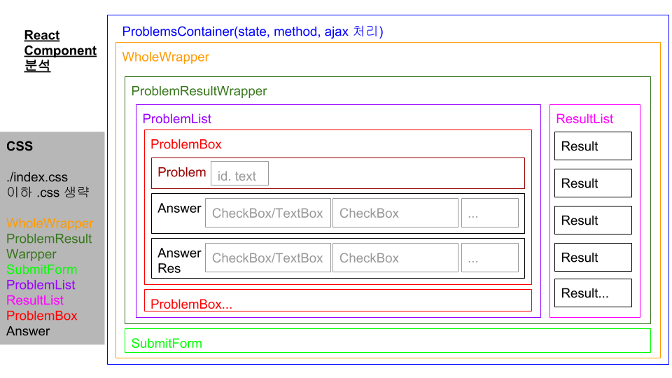
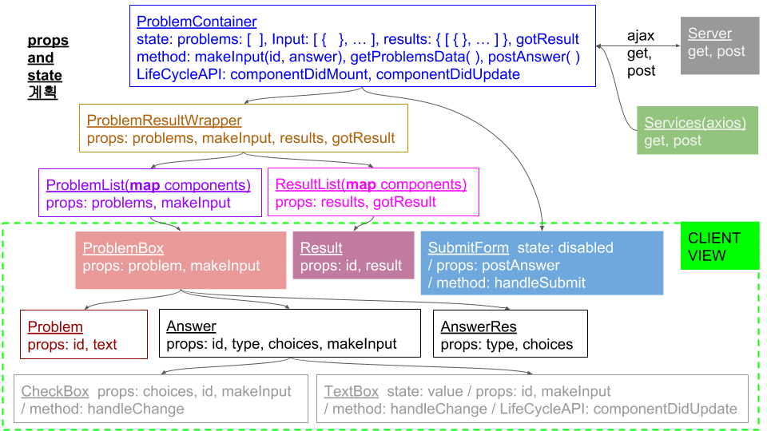

# Web Handout for Students
Work for web handout for students.

## Dev stack
Front Page: React
Ajax Request: Axios
Asynchronous Process Management: async/await

## Function
1. Check answer on the input box, radio and text type.
2. Make JSON type array for student answer.
3. Submit asnwer JSON type data to server.
4. Recieve results: whether correct or not, numbers of answer of problems.
5. Show result with answer.

## Analysis

### Misson Analysis

  

### Components Construction

  

### State and Props of Components Hierarchy

  

## To Do
- axios.post CORS problem
- after solve post problem, go on develope via results data from the server.
